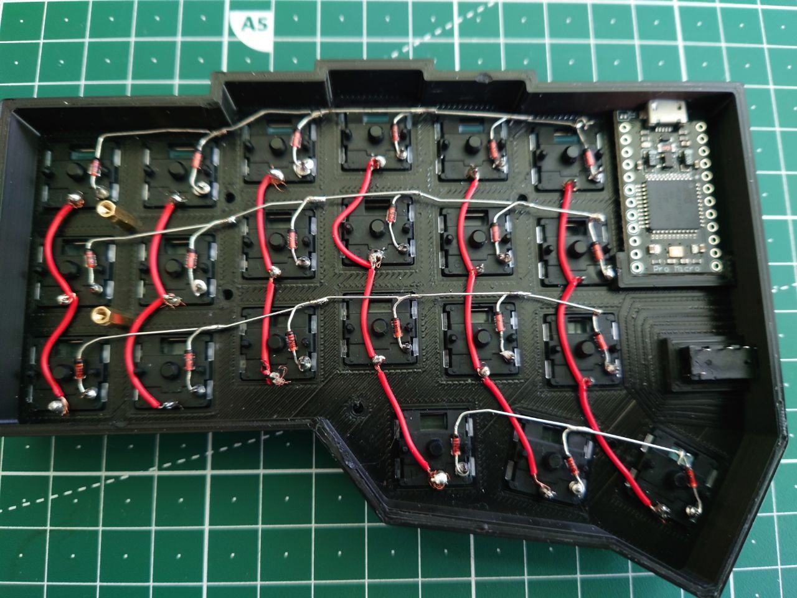
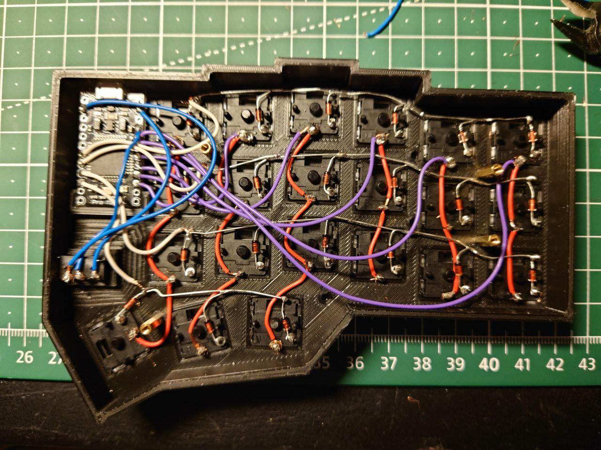
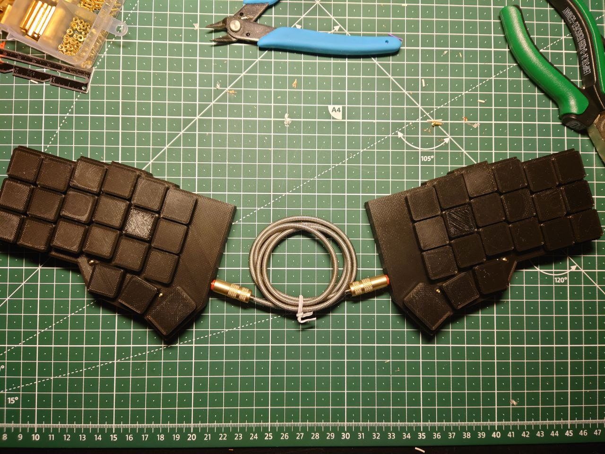

# keyboards

First of all this keyboard layout is not my creation! Its a Blender model of [foostans crkbd](https://github.com/foostan/crkbd) designed to be 3d printed and hand wired. The main idea was to cut the cost of pcbs and cases and to build a flat keyboard. This repo currently serves as a storage for my project files so i might update the blend files if i want to build a better version (this is my first blender project for 3d printing).

This is meant more as a todo list then a build log. If you are interested in the specifics on how to build keyboards i would advice you to check out:
- https://beta.docs.qmk.fm/using-qmk/guides/keyboard-building/hand_wire#common-microcontroller-boards
- https://www.youtube.com/c/JanLunge/videos
- [Jan Lunges disord is also a great place to learn stuff!](https://discord.gg/nR2tCwra)
- https://www.reddit.com/r/ErgoMechKeyboards/

Part list:
- 2x Pro Micro
- 2x Trrs Connectors (The case can snuggly fit [those](https://www.amazon.de/gp/product/B07KYCC7RN/ref=ppx_yo_dt_b_search_asin_title?ie=UTF8&psc=1))
- 2x printed halves
- 42x Diodes
- Wire & Soder
- 42x Choc switches
- 10x Standoff screws
- 1x Trrs Cable
- 42x Keycaps
---
Build images:  

The software for the controller is the default QMK crkbd version for the corne keyboard.
[Pinout translation](https://deskthority.net/wiki/Arduino_Pro_Micro#Pinout)
 <table>
    <tr>
        <th>Row</th>
        <th>Column</th>
        <th>TRRS</th>
    </tr>
        <th>D4/4</th>
        <th>F4/A3</th>
        <th>GNR</th>
    <tr>
        <th>C6/5</th>
        <th>F5/A2</th>
        <th>VCC</th>
    </tr>
    <tr>
        <th>D7/6</th>
        <th>F6/A1</th>
        <th>RXI</th>
    </tr>
    <tr>
        <th>E6/7</th>
        <th>F7/A0</th>
    </tr>
    <tr>
        <th></th>
        <th>B1/15</th>
    </tr>
    <tr>
        <th></th>
        <th>B3/14</th>
    </tr>
</table>

---

